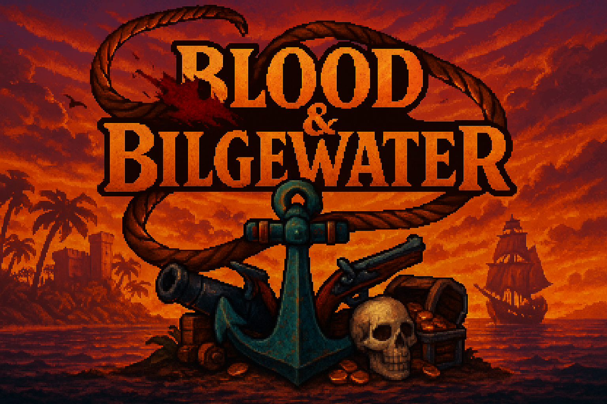
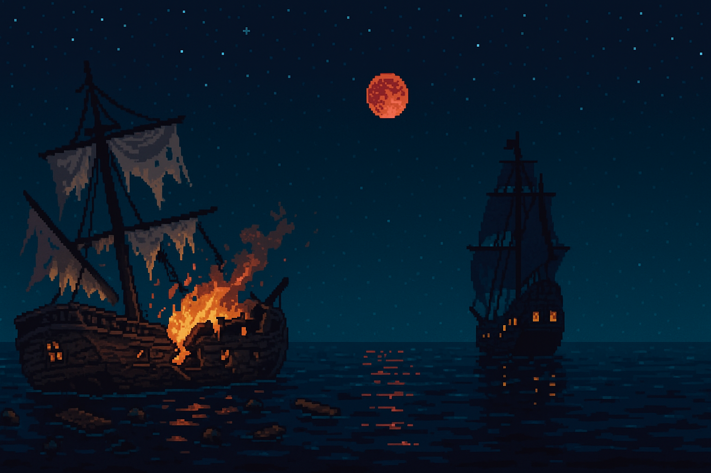

# BloodandBilgewater

A pirate-themed action-RPG built with Rust and Bevy, featuring SNES-era exploration and combat with modern quality-of-life improvements.



<p align="center">
  
</p>

## 🎮 Game Overview

BloodandBilgewater is a single-player action-RPG that puts you in the boots of a shipwrecked sailor rising through the ranks to become a legendary pirate lord. Navigate the high seas, engage in tactical ship-to-ship combat, and build your reputation across a vast archipelago.

<p align="center">
  
</p>

### Key Features

- **Rich Exploration**: Sail between islands, discover hidden treasures, and interact with diverse NPCs
- **Dynamic Combat**: Real-time action combat with timing-based attacks and dodges
- **Ship Management**: Upgrade your vessel, recruit crew members, and engage in epic naval battles
- **Economic Depth**: Establish trade routes, build reputation, and manage resources
- **Modern QoL**: Save anywhere, gamepad remapping, and crisp 60 FPS gameplay

<p align="center">
  
</p>

## 🛠️ Technical Stack

- **Language**: Rust (stable)
- **Engine**: Bevy 0.14
- **Platform**: Desktop (Windows/macOS/Linux) with Steam integration
- **Architecture**: Modular ECS with deterministic game loop

## 🚀 Getting Started

### Prerequisites

- Rust (latest stable)
- Cargo
- Git

### Installation

1. Clone the repository:
   ```bash
   git clone https://github.com/GabeGiancarlo/BloodandBilgewater.git
   cd BloodandBilgewater

	2.	Build the project:

cargo build


	3.	Run the game:

cargo run


📁 Project Structure

BloodandBilgewater/
├── assets/           # Game assets (sprites, audio, etc.)
│   ├── banner.png
│   ├── shipwreck_burning.png
│   ├── ghost_ship_scene.png
│   └── wreckage_and_moon.png
├── src/             # Source code
│   ├── components/  # ECS components
│   ├── systems/     # Game systems
│   ├── plugins/     # Bevy plugins
│   └── main.rs      # Entry point
├── Cargo.toml       # Project dependencies
└── README.md        # This file

🎨 Development Roadmap
	•	Project setup and design documentation
	•	Core game loop implementation
	•	Basic player movement and combat
	•	Ship navigation and combat
	•	Island exploration and NPC interaction
	•	Economic system and trading
	•	Quest system and story progression
	•	Polish and optimization

🤝 Contributing

Contributions are welcome! Please read our Contributing Guidelines for details on our code of conduct and the process for submitting pull requests.

📝 License

This project is licensed under the MIT License - see the LICENSE file for details.

🙏 Acknowledgments
	•	Inspired by classic SNES RPGs and modern pirate adventures
	•	Built with Bevy
	•	Special thanks to the Rust and Bevy communities

⸻

“The sea calls to those who dare to answer…”

---

### Notes:
- Rename your image files accordingly and place them in the `assets/` folder:
  - `shipwreck_burning.png`
  - `ghost_ship_scene.png`
  - `wreckage_and_moon.png'
