<div align="center">

# Blood and Bilgewater

**A dark, gothic, SNES-inspired pirate action-RPG across a cursed archipelago of blood, wreckage, and haunted tides.**


</div>

---

## What we’re building

You wash up in the wreckage. The moon looks like a fresh cut, the keep on the headland has been dead for decades, and the only respectable way off this drowned coast is to **command a crew, rig a ship, and sail the cursed waters yourself.**

**Blood and Bilgewater** is a top-down pirate action-RPG: fight on foot and across boarding planks, salvage haunted wrecks, repair modular ships tile by tile, and grow a crew defined by **roles**—not rigid class locks. The world is a **seeded, persistent sandbox**: deterministic generation, chunk streaming, and a home island hub between voyages. Visually: **gothic nautical decay**—blood-moon skies, salt-rotted timber, lantern-lit docks, crisp nearest-neighbor pixels.

> **Honest status:** early development. The **Starter Island Lab** runs today (procedural island, nine animated crew, trees, patrol AI, player takeover). Full home loop and sailing are design + scaffold.

---

## See it in the lab

```bash
cargo run --example lab --features lab
```

Hold **Space** to follow a crew member. **Ctrl** or the chest icon to take the helm. **WASD** to walk, **Shift** to sprint, **Tab** / **Q** for loadouts, **LMB/RMB** for class actions. Full bindings: [`docs/WIKI.md`](docs/WIKI.md).

### The island

Procedural volcanic and haunted biomes, 64×64 terrain tiles, coast autotiles, and trees that **block at the trunk** but **fade at the crown** when you walk behind them.

| Volcanic shore | Haunted grass | Patrol crew |
| --- | --- | --- |
| 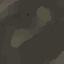 | 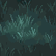 | 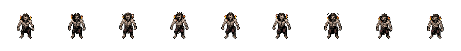 |

<sub>Terrain: `runtime/tilesets/` · Crew: nine roles under `runtime/characters/player_default/`</sub>

### The crew — nine roles, hundreds of sheets

Characters specialize through **roles**. Each role exports loadouts (what they hold), actions (idle / walk / run / slash / shoot / play / dig), and **eight directions** from Aseprite.

<div align="center">

| | | |
|:---:|:---:|:---:|
| 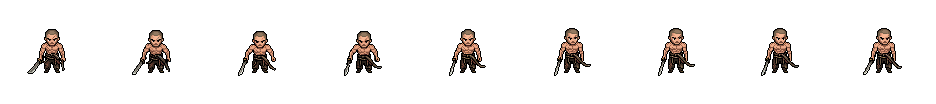 | 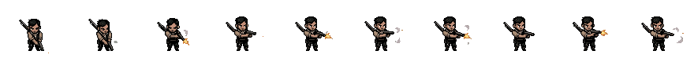 | 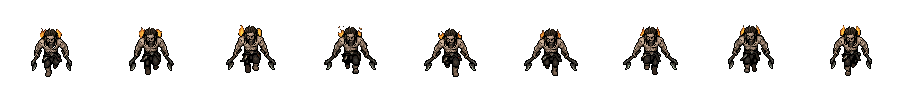 |
| Swordsman | Marksman | Helmsman |
| 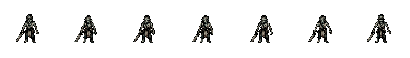 | 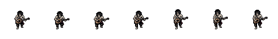 | 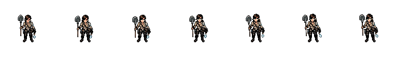 |
| Doctor | Musician | Historian |

</div>

**Every sheet, frame count, cycle length, and pixel size:** [`docs/WIKI.md`](docs/WIKI.md) · **Visual gallery:** [`docs/art/CHARACTER_GALLERY.md`](docs/art/CHARACTER_GALLERY.md)

| Role | Slug | Land focus | Lab loadouts (Tab cycle) |
| --- | --- | --- | --- |
| Swordsman / Boarder | `swordsman` | melee, boarding | sword → empty |
| Gunner / Marksman | `marksman` | firearms | empty → pistol → rifle |
| Helmsman | `helmsman` | ship handling | empty → gun-and-rope → dual-axe |
| Navigator | `navigator` | maps, scouting | empty → eyeglass-and-compass |
| Doctor / Surgeon | `doctor` | healing | empty → needle → saw → saw-and-needle |
| Shipwright | `shipwright` | repairs | empty → hammer-and-box |
| Cook / Quartermaster | `cook` | supplies, morale | empty-hands → knife → spoon-and-stew |
| Musician / Bosun | `musician` | morale, instruments | empty_hands → flute → guitar → trumpet → drum_hold → drum_on_back |
| Historian / Scholar | `archaeologist` | relics, digging | amulet-shovel → amulet → pickaxe |

Design detail: [`docs/systems/ROLES.md`](docs/systems/ROLES.md)

### Flora & fruit

Trees are biome-native (**ashen laurel** on volcanic soil, **moon willow** in haunted ground), with sapling / mature / stump growth and hanging fruit sheets.

| Brineberry | Ghost pear |
| --- | --- |
| 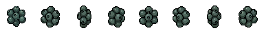 | 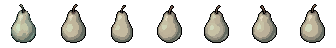 |

<sub>`runtime/props/flora/` — fruit JSON sheets indexed in WIKI after `cargo run --bin generate_wiki`</sub>

### The ship (art + vision)

Ships are authored in **eight directions** from Aseprite masters under `assets/source/ships/`. Modular **64×64 ship tiles** align to the world grid; stations (helm, guns, cargo) attach to tile coordinates. Gameplay plugin is still scaffold—see [`docs/systems/SHIP.md`](docs/systems/SHIP.md).

<div align="center">


<sub>Export ship rotation previews to `docs/art/preview/` for README embeds. Sources: `assets/source/ships/`.</sub>

</div>

---

## Engine & architecture

| Layer | Choice |
| --- | --- |
| Runtime | **Rust + Bevy 0.14**, ECS, desktop / Steam-first |
| Simulation | Deterministic seed, command-driven input (no raw keys in sim) |
| Art pipeline | **Aseprite** → PNG + JSON under `assets/runtime/` |
| World tiles | **64×64 px** display; **32 px** logic cells for collision |

Enforceable rules: [`docs/ARCHITECTURE_RULES.md`](docs/ARCHITECTURE_RULES.md) · Unity prototype preserved on the `unity-migration-snapshot` branch (see [`docs/migration/`](docs/migration/)).

### Repository map

```text
BloodandBilgewater/
├── src/                     # Bevy game: gameplay, rendering, lab, world
├── examples/lab.rs          # Starter Island Lab harness
├── assets/
│   ├── source/              # Aseprite masters (never loaded at runtime)
│   └── runtime/             # PNG + JSON the engine loads
├── docs/
│   ├── README.md            # Documentation hub
│   ├── WIKI.md              # All animation sheets + lab numbers (generated)
│   ├── TILESET_RULES.md     # Tile adjacency & biome families (generated)
│   └── art/                 # Character + tile visual galleries (generated)
└── tools/art_pipeline/      # Export helpers
```

---

## Tile libraries & adjacency

**164+ terrain PNGs** across beach, volcanic, haunted, mangrove, cliff, ocean, and shallow sets. Tiles are **not** free-painted—they follow coast masks and biome blend bands.

| Rule | Detail |
| --- | --- |
| Size | 64×64 px, nearest-neighbor |
| Ocean ↔ land | Must use coast / corner / bridge modules |
| Volcanic ↔ haunted | `BiomeBlend` strip; no raw interior across border |
| Cohesion | 72% neighbor variant match (WFC-style, local) |

Full libraries + rules: [`docs/art/TILESET_GALLERY.md`](docs/art/TILESET_GALLERY.md) · [`docs/TILESET_RULES.md`](docs/TILESET_RULES.md)

---

## Documentation

| Doc | Contents |
| --- | --- |
| [`docs/README.md`](docs/README.md) | Hub — systems, art, architecture |
| [`docs/WIKI.md`](docs/WIKI.md) | Every animation sheet + lab constants |
| [`docs/systems/HOME_LOOP.md`](docs/systems/HOME_LOOP.md) | Shipwreck → home → voyage vision |
| [`docs/systems/PLAYER.md`](docs/systems/PLAYER.md) | On-foot control |
| [`assets/README.md`](assets/README.md) | Source vs runtime layout |

Regenerate wiki tables after art exports:

```bash
cargo run --bin generate_wiki
```

---

## Getting started

Requires stable Rust.

```bash
# Default app entry (scaffold)
cargo run

# Starter Island Lab — playable island + crew
cargo run --example lab --features lab

# Refresh WIKI + galleries from assets
cargo run --bin generate_wiki
```

---

## Vision in one paragraph

We want the feeling of **Sunless Sea’s dread** and **classic Zelda pacing** on a **living pirate sandbox**: your island is a cluttered, repairable home; your ship is a tile-built machine you walk across in combat; your crew are individuals with roles that matter in voyage prep and on the deck. The lab proves the hardest part first—**eight-way character animation, terrain cohesion, and on-foot control**—on a cursed starter island before the full loop ships.

---

## License

MIT — see [`LICENSE`](LICENSE). Design intent: [`DESIGN_DOCUMENT.md`](DESIGN_DOCUMENT.md).

<div align="center">

<sub>Blood and Bilgewater — scrub the deck, align the guns, raise the cursed banner.</sub>

</div>
