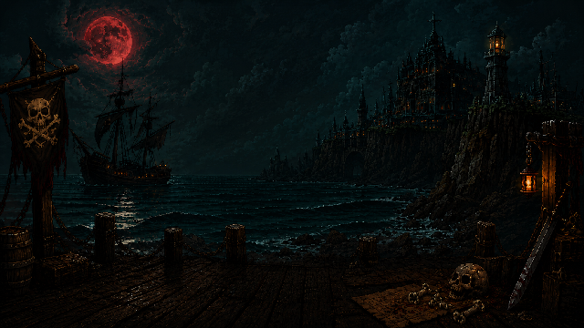
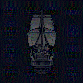
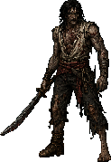
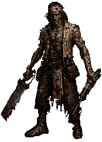
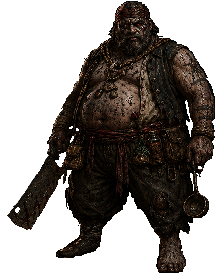

<div align="center">

# Blood and Bilgewater

**A dark, gothic, SNES-inspired pirate action-RPG set across a cursed archipelago of blood, wreckage, and haunted tides.**


<br>



</div>

---

## The Pitch

You wake in the wreckage. The moon is the color of a wound, the keep on the headland is long dead, and the only way off this drowned coast is to **claw your way back onto a deck and take the cursed seas for yourself.**

**Blood and Bilgewater** is a top-down pirate action-RPG built around a haunted, storm-bitten archipelago. Fight on foot and across boarding planks, haul loot out of sunken wrecks, repair and re-rig modular ships, and grow a crew defined by **roles** rather than rigid classes.

The world is a **procedurally seeded, persistent sandbox**: deterministic generation from a seed, chunk/region streaming, tile-based ships, and a persistent home island as the prep hub between voyages. The whole thing wears a single aesthetic — **gothic nautical decay**: blood-moon skies, lantern-lit docks, salt-rotted timber, and crisp nearest-neighbor pixel art.

> **Honest status:** early-development. Art masters exist; the engine is **Rust + Bevy 0.14** and the project builds. Gameplay systems are scaffolding, not a finished game.

---

## Engine — Rust + Bevy 0.14 (active)

This repository is **Bevy-first**. A brief Unity 2D experiment was evaluated and **reversed**; the Unity project is preserved as archived reference only.

- **Active engine:** Rust + **Bevy 0.14**, ECS architecture, desktop / **Steam-first**.
- **Unity:** archived under [`Archive/UnityPrototype/`](Archive/UnityPrototype/) — reference only, not active game code.
- **Art source of truth:** **Aseprite** files under `assets/source/aseprite/`.
- **Runtime assets:** exported **PNG / JSON** under `assets/textures/` and `assets/data/`, loaded by Bevy.
- The legacy/archived Bevy copy lives at [`Archive/BevyReference/`](Archive/BevyReference/) (backup); the active project is restored at the repo root.

Full migration record: [`docs/migration/`](docs/migration/) — see
[`bevy_restoration_summary.md`](docs/migration/bevy_restoration_summary.md).

---

## Getting Started (Bevy)

Requires a recent stable Rust toolchain.

```bash
# Run the game
cargo run

# Run the developer "Lab" harness (tile / shoreline experiments)
cargo run --example lab --features lab
```

The first milestone target is **Bevy Proof 01 — Starter Island Animation Lab** (camera, one
character sprite, beach/shallow-water/ocean tiles, keyboard + controller movement, idle/walk
scaffold). See [`docs/migration/bevy_restoration_summary.md`](docs/migration/bevy_restoration_summary.md).

---

## The Cursed Fleet — Sprite Sheet & Spin

Every ship is authored once in Aseprite and rendered across **8 directions**.

<div align="center">


<sub>8-direction rotation sheet — `docs/art/preview/ship_rotation_sheet.png`</sub>

<br><br>



<sub>Looping spin built from the real rotation frames.</sub>

</div>

Ship sources now live at `assets/source/aseprite/ships/default_3_sails/`.

---

## The Crew — Animated Roster

Characters specialize through **roles**, not hard class locks. Shown below are classes with animation work done.

<div align="center">


&nbsp;

&nbsp;

&nbsp;

&nbsp;


<sub>Animated classes (WIP) — Swordsman, Marksman, Surgeon, Shipwright, Quartermaster.</sub>

</div>

| Role | Pitch |
| --- | --- |
| **Swordsman / Boarder** | Close combat, boarding actions, deck defense. |
| **Gunner / Marksman** | Firearms, cannon work, ranged pressure. |
| **Doctor / Surgeon** | Healing, injury control, grim battlefield survival. |
| **Shipwright** | Repairs, hull maintenance, crafting support. |
| **Cook / Quartermaster** | Supplies, morale, storage and rationing. |

Character sources: `assets/source/aseprite/characters/player_default/<class>/` ·
runtime/raw frames: `assets/textures/characters/player_default/<class>/`.

---

## Art Pipeline — Aseprite Is The Source of Truth

- `.aseprite` masters live under **`assets/source/aseprite/`** (characters, tilesets, ships, props, ui, references).
- Runtime exports (PNG sprite sheets + JSON metadata) live under **`assets/textures/`** and **`assets/data/`**, loaded by Bevy with nearest-neighbor sampling to stay crisp.
- World/grid tiles follow a **64×64** standard.
- Migration + export helpers live in [`tools/art_pipeline/`](tools/art_pipeline/).

---

## Repository Layout

```text
BloodandBilgewater/
├── Cargo.toml / Cargo.lock
├── src/                     # Bevy game (ECS): app, gameplay, rendering, world, ui, lab, ...
├── examples/lab.rs          # standalone dev harness (cargo run --example lab --features lab)
├── assets/
│   ├── source/
│   │   ├── aseprite/         # SOURCE OF TRUTH: characters, ships, tilesets, props, ui, references
│   │   └── references/       # concept / reference PNG
│   ├── textures/             # runtime PNG (characters, props, ...)
│   ├── data/                 # gameplay data (classes, items, loot_tables, ships, world)
│   ├── audio/                # music, sfx
│   └── fonts/                # UI fonts (verify licensing before redistribution)
├── docs/
│   └── migration/            # restoration audit, manifest, move log, system map, summary
├── tools/art_pipeline/       # art migration + pipeline scripts
└── Archive/
    ├── UnityPrototype/        # archived Unity project (reference only)
    ├── BevyReference/         # backup of the archived Bevy source
    └── LegacyRuntimePngExports/  # old runtime PNG exports (README previews source)
```

---

## Roadmap

- [x] Reverse the Unity migration and restore **Rust + Bevy 0.14** as the active engine
- [x] Preserve all Unity-phase Aseprite + PNG art into the Bevy asset structure
- [x] Archive the Unity prototype as reference only
- [ ] **Bevy Proof 01 — Starter Island Animation Lab** (camera, one character, beach/shallow/ocean tiles, movement, idle/walk)
- [ ] Aseprite → sprite-sheet export script + metadata convention
- [ ] Data-driven character/role definitions in `assets/data/` (RON/JSON)
- [ ] Controller support and input mapping
- [ ] Tile / chunk streaming for islands

See also: [`docs/ROADMAP.md`](docs/ROADMAP.md) and [`docs/DESIGN_SNAPSHOT.md`](docs/DESIGN_SNAPSHOT.md).

---

## License & Credits

Licensed under the **MIT License** — see [`LICENSE`](LICENSE). Design intent lives in
[`DESIGN_DOCUMENT.md`](DESIGN_DOCUMENT.md) and [`docs/`](docs/). All art shown is
work-in-progress and part of this repository.

<div align="center">

<sub>Blood and Bilgewater — the deck is scrubbed, the cannons aligned, and the cursed banner raised.</sub>

</div>
