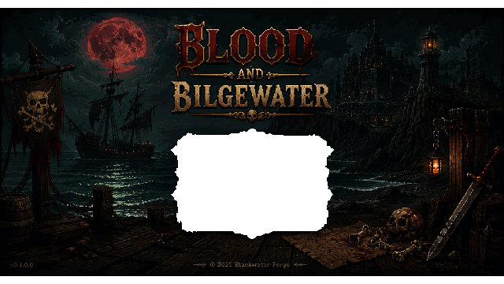
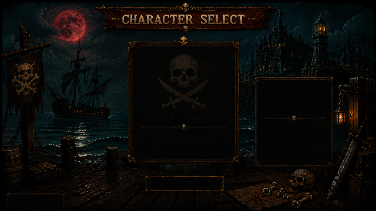
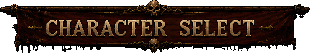
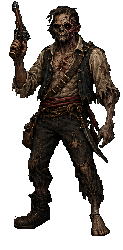
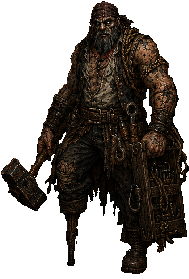
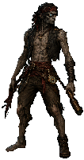

<div align="center">



# Blood and Bilgewater

**A dark, SNES-inspired pirate action-RPG set across a cursed archipelago of blood, wreckage, and haunted tides.**


-2d2d2d?style=flat-square)


</div>

---

## Overview

**Blood and Bilgewater** is a top-down pirate action-RPG and sandbox built around a cursed, storm-bitten archipelago. You begin in the wreckage and claw your way back to the deck — exploring haunted waters, fighting on foot and at sea, hauling loot, and crewing ships shaped by the roles your characters grow into.

The world is designed as a **procedurally seeded, persistent sandbox**: deterministic generation from a seed, chunk/region streaming, modular tile-based ships, and a persistent home island planned as the prep hub between voyages. Characters persist across worlds and specialize through **roles** rather than rigid classes, so anyone can steer, fire, and repair — specialists simply do it better.

Visually the project leans into a **gothic, nautical-decay** identity: blood-moon skies, drowned wrecks, lantern-lit docks, and clustered pixel-art rendered with crisp nearest-neighbor scaling.

> **Honest status:** this is an early-development project in the asset and prototype phase. The current reference implementation is a Rust + Bevy codebase; gameplay systems are scaffolded as plugins and are not a finished, shippable game. The repository is now being prepared for a future **Unity migration**.

---

## Visual Direction

Mood and identity, drawn from existing art in the repository.

| Preview | Description |
| --- | --- |
|  | **Title / menu mood** — blood-moon harbor, ghost ship, and a decaying cliffside keep. |
|  | **Character select** (UI mockup) — ornate framed roster over the cursed coast. |
|  | **Ocean exploration** (concept) — silhouetted galleon, ruined keep, burning horizon. |
|  | **Conflict at sea** (concept) — a burning wreck adrift under a red moon. |

<div align="center">



</div>

---

## Game Pillars

- **Rise from wreckage** — start broken and stranded; rebuild into a captain of the cursed seas.
- **Earned melee & ranged combat** — readable, SNES-inspired action on foot and across decks.
- **Haunted ocean exploration** — deterministic, seed-driven waters, wrecks, and hidden coves.
- **Ships as survival tools** — modular, tile-based vessels with hull, cannons, masts, and stations.
- **Roles, not hard class locks** — specialization that shapes a crew without gating basic actions.
- **A home island to grow** — a persistent prep hub for stash, dock, shipyard, and voyage launch *(planned)*.
- **Gothic pirate tone** — blood, salt, lantern-light, and nautical decay throughout.

*Pillars reflect the design captured in [`docs/`](docs/); several systems are still scaffolding.*

---

## Current Development Status

| Area | State |
| --- | --- |
| Project phase | Early development — asset & prototype phase |
| Reference engine | Rust + Bevy (current source of truth for architecture & data) |
| Gameplay systems | Plugin scaffolding (world, generation, persistence, simulation, UI, etc.) |
| Art | Source masters (`.aseprite`) + runtime PNG exports being organized |
| Unity migration | **Being prepared** — not yet active |

---

## Tech Stack

**Current**

- **Rust** (edition 2021)
- **Bevy `0.14`** — ECS-style engine, plugin-first architecture
- **serde** for serialization, **rand** (`small_rng`) for deterministic RNG
- **Aseprite** source art with a pixel-art runtime export pipeline
- **Git** for version control; `Cargo.lock` is tracked for reproducible builds

**Future / migration**

- A **Unity** migration is in preparation to leverage Unity's 2D tooling, controller support, and deployment workflow.
- The Rust/Bevy code remains a **reference** for systems, data models, and architectural separation while assets are cleaned for export.

> Unity is **not** the active engine yet — there is no Unity project committed to this repository.

---

## Roles / Crew Fantasy

Characters specialize through **roles**. Captain and First Mate are **ship/session ranks**, not classes. Full design: [`docs/systems/ROLES.md`](docs/systems/ROLES.md).

| Role | Fantasy |
| --- | --- |
| Swordsman / Boarder | Close combat, boarding, deck defense |
| Gunner / Marksman | Firearms, cannons, ranged pressure |
| Helmsman | Steering, evasive movement, ship handling |
| Navigator | Routes, map reading, discovery |
| Doctor / Surgeon | Healing, injury control, survival |
| Shipwright | Repairs, hull maintenance, crafting support |
| Cook / Quartermaster | Supplies, morale, storage |
| Musician / Bosun | Rhythm, morale, coordination |
| Historian / Scholar | Relics, ruins, cursed knowledge |

<div align="center">


&nbsp;&nbsp;

&nbsp;&nbsp;

&nbsp;&nbsp;

&nbsp;&nbsp;


<sub>Character-select art — Swordsman, Marksman, Doctor, Shipwright, Navigator (work in progress).</sub>

</div>

*Roles are a structural foundation today; abilities, skill trees, and bonuses are not implemented yet.*

---

## Art Pipeline

Blood and Bilgewater keeps **editable source art** separate from **runtime exports**.

- `.aseprite` files are the **source/editing masters** (layers, tags, guides) under `assets/source/aseprite/`.
- `.png` files are the **runtime assets** the engine loads, under `assets/sprites/`, `assets/tilesets/`, and `assets/ui/`.
- World/grid tiles follow a strict **64×64** standard; animated sheets are sliced into 64×64 frames.
- Pixel art is rendered with nearest-neighbor sampling to stay crisp.

No sprite sheets are exported or modified as part of this README. Details: [`docs/art/ASSET_PIPELINE.md`](docs/art/ASSET_PIPELINE.md), [`docs/art/TILE_ASSET_PIPELINE.md`](docs/art/TILE_ASSET_PIPELINE.md), [`docs/art/TILESET_SPECS.md`](docs/art/TILESET_SPECS.md).

---

## Repository Layout

```text
BloodandBilgewater/
├── assets/
│   ├── source/         # Aseprite masters + concept/reference art (not loaded at runtime)
│   ├── sprites/        # Runtime entity/character sprites
│   ├── tilesets/       # Runtime tilemap PNGs (ocean, beach, ...)
│   ├── ui/             # Runtime UI: titlescreen, menus, icons, hud
│   ├── fonts/          # Pixel display fonts
│   ├── audio/          # Runtime audio
│   └── data/           # Runtime data tables
├── src/                # Rust + Bevy source (plugin-first)
│   ├── app/  core/  input/  events/  world/  generation/  chunking/
│   ├── persistence/  simulation/  time/  networking/
│   ├── gameplay/  rendering/  ui/  lab/
├── examples/           # Standalone dev harness (the Lab)
├── docs/               # Architecture rules, ADRs, art specs, system design
├── Cargo.toml          # Crate manifest
└── README.md
```

Deeper structure and ownership rules: [`docs/ARCHITECTURE_RULES.md`](docs/ARCHITECTURE_RULES.md).

---

## Running the Current Bevy Prototype

### Prerequisites

- [Rust](https://rustup.rs/) (latest stable) and Cargo
- Git

### Build & run

```bash
git clone https://github.com/GabeGiancarlo/BloodandBilgewater.git
cd BloodandBilgewater
cargo run
```

Optional world seed:

```bash
WORLD_SEED=12345 cargo run
```

Run the tests:

```bash
cargo test
```

### The Lab (developer harness)

A standalone scene for iterating on tiles and rendering, separate from the main game:

```bash
cargo run --example lab --features lab
```

*(Command sourced directly from `examples/lab.rs` and the `lab` feature in `Cargo.toml`.)*

---

## Unity Migration Prep

The Unity migration is being planned so the project can take advantage of Unity's 2D tooling, controller support, deployment workflow, and asset pipeline. The current Rust/Bevy repository remains useful as a **reference** for architecture, gameplay data, and system separation while art and design assets are cleaned for export.

This is preparation, not a port that exists today — and it is **not** a promise of any specific platform or console release.

---

## Roadmap

- [x] Clean source and runtime art folders (pre-migration pass)
- [ ] Build first Unity import test
- [ ] Import ocean / shoreline tiles
- [ ] Import one character direction sheet
- [ ] Create first Unity test scene
- [ ] Rebuild input, animation, and tilemap systems
- [ ] Recreate role data as Unity ScriptableObjects
- [ ] Preserve Bevy architecture docs as reference

**Asset TODOs**

- [ ] Capture live in-engine gameplay screenshots (current previews are mockups + concept art).
- [ ] Add ship/tilemap previews once runtime ship tiles are finalized.

See also: [`docs/ROADMAP.md`](docs/ROADMAP.md) and [`docs/DESIGN_SNAPSHOT.md`](docs/DESIGN_SNAPSHOT.md).

---

## Development Notes

- **Plugin-first architecture:** gameplay and core systems are Bevy plugins; `main.rs` stays minimal.
- **Input → commands → simulation:** simulation consumes commands/events, never raw device input.
- **Deterministic by design:** worldgen and simulation are seed-driven and fixed-timestep where it matters.
- **Presentation is separate:** rendering and UI never own authoritative game state.

Contributions should follow [`CONTRIBUTING.md`](CONTRIBUTING.md) and [`docs/ARCHITECTURE_RULES.md`](docs/ARCHITECTURE_RULES.md).

---

## License & Credits

Licensed under the **MIT License** — see [`LICENSE`](LICENSE).

Design intent and background live in [`DESIGN_DOCUMENT.md`](DESIGN_DOCUMENT.md) and the [`docs/`](docs/) directory. Art assets shown above are work-in-progress and part of this repository.

<div align="center">

<sub>Blood and Bilgewater — the deck is scrubbed, the cannons aligned, and the cursed banner raised.</sub>

</div>
