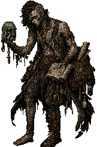
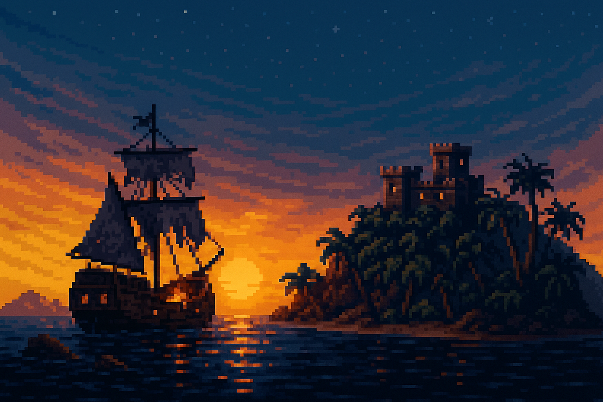
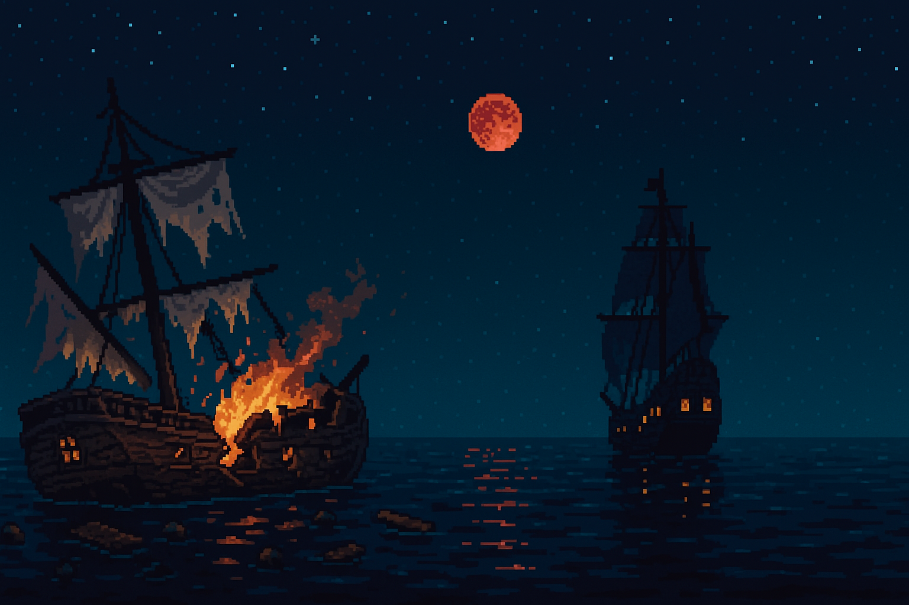

<div align="center">


# Blood and Bilgewater

**A dark, gothic, SNES-inspired pirate action-RPG set across a cursed archipelago of blood, wreckage, and haunted tides.**


-2d2d2d?style=flat-square)


<br>


</div>

---

## The Pitch

You wake in the wreckage. The moon is the color of a wound, the keep on the headland is long dead, and the only way off this drowned coast is to **claw your way back onto a deck and take the cursed seas for yourself.**

**Blood and Bilgewater** is a top-down pirate action-RPG built around a haunted, storm-bitten archipelago. Fight on foot and across boarding planks, haul loot out of sunken wrecks, repair and re-rig modular ships, and grow a crew defined by **roles** rather than rigid classes — anyone can steer, fire, and patch a hull; specialists just do it better and bloodier.

The world is a **procedurally seeded, persistent sandbox**: deterministic generation from a seed, chunk/region streaming, tile-based ships, and a persistent home island planned as the prep hub between voyages. The whole thing wears a single aesthetic — **gothic nautical decay**: blood-moon skies, lantern-lit docks, salt-rotted timber, and crisp nearest-neighbor pixel art.

> **Honest status:** this is an early-development project in the asset + prototype phase. Art masters exist and the project has just migrated onto **Unity 2D** with **Aseprite as the source of truth**. Gameplay systems are scaffolding, not a finished game.

---

## The Cursed Fleet — Sprite Sheet & Spin

Every ship is authored once in Aseprite and rendered across **8 directions**. Here is the default cursed galleon — first as its directional **sprite sheet**, then **spinning** through every heading:

<div align="center">


<sub>8-direction rotation sheet — `docs/art/preview/ship_rotation_sheet.png`</sub>

<br><br>


<sub>Looping spin built from the real rotation frames — `docs/art/preview/ship_rotation_spin.gif`</sub>

</div>

> Both previews are generated from the actual game frames by [`tools/build-readme-art.ps1`](tools/build-readme-art.ps1) — no hand-drawn mockups, no AI re-render. Re-run it any time the ship art changes.

---

## The Crew — Choose Your Cursed

Characters specialize through **roles**, not hard class locks. Captain and First Mate are **ship/session ranks**, not classes. Below is the current character-select art — a roster of weathered, half-drowned souls, each built for a job aboard a dying ship. Full design: [`docs/systems/ROLES.md`](docs/systems/ROLES.md).

<div align="center">


&nbsp;

&nbsp;

&nbsp;

<br><br>

&nbsp;

&nbsp;


<sub>Character-select art (WIP) — Swordsman, Marksman, Surgeon, Shipwright, Navigator, Quartermaster, Historian.</sub>

</div>

| Role | Pitch | Reads From The Art |
| --- | --- | --- |
| **Swordsman / Boarder** | Close combat, boarding actions, deck defense. | Lean cutthroat with a notched cutlass, made for the plank. |
| **Gunner / Marksman** | Firearms, cannon work, ranged pressure. | Flintlock raised, powder-burned and steady-eyed. |
| **Doctor / Surgeon** | Healing, injury control, grim battlefield survival. | Cleaver and bone-saw — mercy and butchery in one kit. |
| **Shipwright** | Repairs, hull maintenance, crafting support. | Hulking bruiser hauling a maul and salvaged ironwork. |
| **Navigator** | Routes, map-reading, discovery, evasive plotting. | Quick, knife-handed scout who reads the cursed tides. |
| **Cook / Quartermaster** | Supplies, morale, storage and rationing. | Heavyset keeper of the hold with a blunderbuss for "disputes". |
| **Historian / Scholar** | Relics, ruins, and cursed knowledge. | Robed gravedigger clutching a glowing relic and a sodden tome. |

*Roles are a structural foundation today; abilities, skill trees, and bonuses are not implemented yet.*

---

## The World — Concept & Mood

Reference and concept art that set the tone for exploration and conflict.

| Preview | Description |
| --- | --- |
|  | **Character select** (UI mockup) — ornate framed roster over the drowned coast. |
|  | **Ocean exploration** (concept) — silhouetted galleon, ruined keep, burning horizon. |
|  | **Conflict at sea** (concept) — a burning wreck adrift under a red moon. |
|  | **UI banner** — the framed "Character Select" header treatment. |

---

## Game Pillars

- **Rise from wreckage** — start broken and stranded; rebuild into a captain of the cursed seas.
- **Earned melee & ranged combat** — readable, SNES-inspired action on foot and across decks.
- **Haunted ocean exploration** — deterministic, seed-driven waters, wrecks, and hidden coves.
- **Ships as survival tools** — modular, tile-based vessels with hull, cannons, masts, and stations.
- **Roles, not hard class locks** — specialization that shapes a crew without gating basic actions.
- **A home island to grow** — a persistent prep hub for stash, dock, shipyard, and voyage launch *(planned)*.
- **Gothic pirate tone** — blood, salt, lantern-light, and nautical decay throughout.

*Pillars reflect the design captured in [`docs/`](docs/); several systems are still scaffolding.*

---

## Art Pipeline — Aseprite Is The Source of Truth

The project authors art **once** in Aseprite and lets Unity import it directly — no manual PNG export as the normal workflow.

- `.aseprite` masters live under **`unity/Assets/_Project/Art/Aseprite/`** (Characters, Tilesets, UI, Props, Ships, FX) and are imported by Unity's **2D Aseprite Importer**.
- World/grid tiles follow a strict **64×64** standard; animated sheets are sliced into 64×64 frames.
- Pixel art renders with nearest-neighbor sampling to stay crisp.
- Legacy runtime PNG exports are kept for reference under **`Archive/LegacyRuntimePngExports/`** (this is also where the README previews above are sourced from).

Full workflow: [`docs/ASEPRITE_UNITY_WORKFLOW.md`](docs/ASEPRITE_UNITY_WORKFLOW.md) · pipeline specs: [`docs/art/ASSET_PIPELINE.md`](docs/art/ASSET_PIPELINE.md), [`docs/art/TILESET_SPECS.md`](docs/art/TILESET_SPECS.md).

---

## Current Development Status

| Area | State |
| --- | --- |
| Project phase | Early development — asset & prototype phase |
| Active engine | **Unity 2D** (project under `unity/`) |
| Art source of truth | **Aseprite** masters under `unity/Assets/_Project/Art/Aseprite/` |
| Legacy reference | Rust + Bevy, archived under `Archive/BevyReference/` |
| Gameplay systems | Re-scaffolding in Unity; Bevy code kept as architecture reference |
| First flow target | `MainMenu → CharacterSelect → TestIsland` |

---

## Repository Layout

```text
BloodandBilgewater/
├── unity/                       # Unity 2D project (active)
│   └── Assets/_Project/
│       ├── Art/Aseprite/        # SOURCE OF TRUTH: .aseprite masters (imported by Unity)
│       │   ├── Characters/  Tilesets/  UI/  Props/  Ships/  FX/
│       ├── Art/References/       # concept + reference art
│       ├── Scripts/              # C# (Core, Player, Camera, UI, Data, Gameplay/...)
│       ├── Scenes/  Prefabs/  ScriptableObjects/  Data/  Audio/  Tilemaps/
│       └── ...
├── Archive/
│   ├── BevyReference/            # archived Rust + Bevy source (reference only)
│   └── LegacyRuntimePngExports/  # old runtime PNG exports (README previews source)
├── docs/                         # design, architecture, art specs, migration docs
│   └── art/preview/              # generated README art (sprite sheet + spin GIF)
├── tools/                        # migration + art-build PowerShell scripts
└── README.md
```

Deeper structure and rules: [`docs/ARCHITECTURE_RULES.md`](docs/ARCHITECTURE_RULES.md) · migration detail: [`docs/UNITY_MIGRATION.md`](docs/UNITY_MIGRATION.md).

---

## Getting Started (Unity)

1. Open the project at **`unity/`** in the Unity Editor.
2. Install the **2D Aseprite Importer** (+ 2D Sprite, 2D Tilemap, Cinemachine) via **Window → Package Manager**.
3. Confirm `Assets/_Project/Art/Aseprite/` appears and `.aseprite` files import as sprites.
4. Follow the first-playable checklist in [`docs/UNITY_MIGRATION.md`](docs/UNITY_MIGRATION.md): build `MainMenu → CharacterSelect → TestIsland`.

**Rebuild README previews** (sprite sheet + spinning GIF) any time the ship art changes:

```powershell
powershell -ExecutionPolicy Bypass -File .\tools\build-readme-art.ps1
```

### Legacy Bevy prototype (reference)

The original Rust/Bevy build is preserved under `Archive/BevyReference/` for architecture and data reference. It is **not** the active engine.

---

## Roadmap

- [x] Migrate repository onto a Unity 2D project structure
- [x] Move Aseprite masters into Unity as the source of truth
- [x] Archive legacy Bevy source and runtime PNG exports
- [ ] Install the 2D Aseprite Importer and verify direct import
- [ ] Import ocean / shoreline tiles and one character direction sheet
- [ ] Build `MainMenu → CharacterSelect → TestIsland`
- [ ] Recreate role data as Unity ScriptableObjects
- [ ] Capture live in-engine gameplay screenshots (current previews are art + mockups)

See also: [`docs/ROADMAP.md`](docs/ROADMAP.md) and [`docs/DESIGN_SNAPSHOT.md`](docs/DESIGN_SNAPSHOT.md).

---

## License & Credits

Licensed under the **MIT License** — see [`LICENSE`](LICENSE).

Design intent and background live in [`DESIGN_DOCUMENT.md`](DESIGN_DOCUMENT.md) and the [`docs/`](docs/) directory. All art shown is work-in-progress and part of this repository.

<div align="center">

<sub>Blood and Bilgewater — the deck is scrubbed, the cannons aligned, and the cursed banner raised.</sub>

</div>
